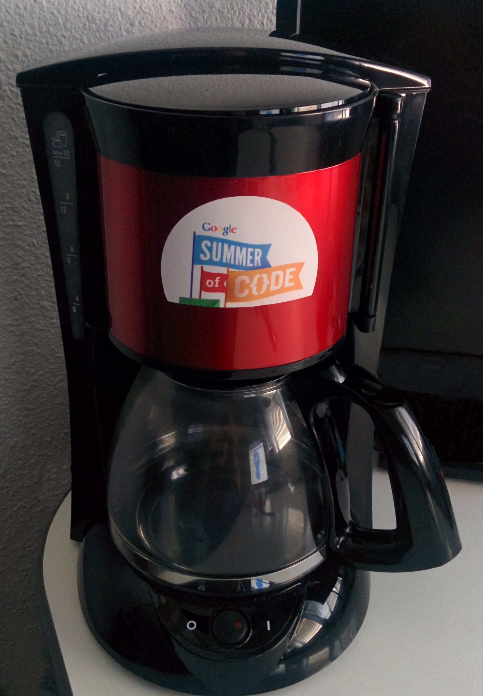

## Google Summer of Code 2016
Project Smart Coffee Machine with proximity pairing

Student Alexis Duque

*Developed under GSoC 2016 project Physical Web Project*

Physical Web Smart Coffee Machine with proximity pairing
-----------


### Projet overview

To briefly sum up the project, I would say that the primary goal is to demonstrate how fun can be Physical Web and how it can make our life better, making a Physical Web enabled smart coffee machine.
This coffee machine can guess your coffee preferences and brew for you a coffee as soon as you are in proximity, without you have to do anything, thanks to your personal Physical Web beacon.
It can be an own machine, at home, at work, or in any public place, like a bar or a restaurant.

A [Progressive Web App](https://physical-web-coffee.firebaseapp.com/) lets you by sign-in with your Google account, select your coffee preferences, and generate a short URL that resolves to these settings.
Then, opening the app on your smartphone, you can just by one click, configure you Physical Web compatible beacon with this URL.

Right now, just draw near a compatible coffee maker with your beacon and let it do the job for you!
As soon as you coffee is ready, you will receive a push notification, telling you, you can take it. Also, if you are in a bar or at work, and a couple of coffees are scheduled, the app lets you see in real time your position in the queue.



The project includes an [electronic circuit design](documentation/hardware.md), to interface a sanard coffee maker with the Intel Edison breakout board which support Bluetooth Low Energy, and Wifi.

The Edison board is connected to the Internet through Wifi and scan for a Physical Web beacon. When a URL Beacon enters at proximity, it resolves the URL, grabs your settings, and trigger a coffee brewing by changing the GPIO state.

Also, to illustrate all the functionalities and possibilities of this project a [coffee maker simulator](https://physical-web-coffee-simulator.firebaseapp.com/), that can emulate and show in a nice way, what it may happen if you are in a bar that offers a large range of coffee.

[Physical Web Coffee Maker Progressive Web App](https://physical-web-coffee.firebaseapp.com/)

[Coffee Maker simulator](https://physical-web-coffee-simulator.firebaseapp.com/)

### Technical Stack
#### Web
- Web Components and Polymer
- Firebase backend
- Firebash Push Messenger

#### Peripheral
- Intel Edison (+ Breakout board)
- Node JS + Bluez 5.3
- Physical Web
- Eddystone URL

### Documentation

[Hardware modification](documentation/hardware.md)

[Edison box](documentation/casing.md)

[Edison Linux setup](edison/coffee-ble-central/README.md)

### Repo organization

```
|-- web             # the progressive web app
|   |-- public
|   
|-- web-simulator   # the coffee machine web simulator
|   |-- public
|   
|-- hardware        # hardware modification of the coffee maker
|   |-- picture
|   
|-- edison
|   |-- coffee-ble-central
|   |-- coffee-ble-peripheral
|   
|-- beacon      # firmware of EddystoneURL beacon implementation on nrf51822
|   
|-- tools       # some tools (not used yet)
```
