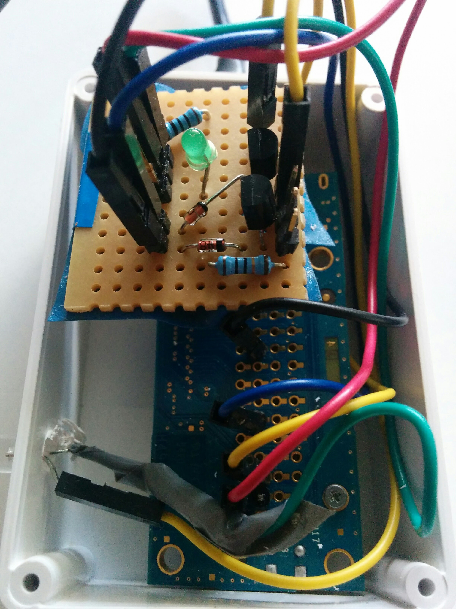
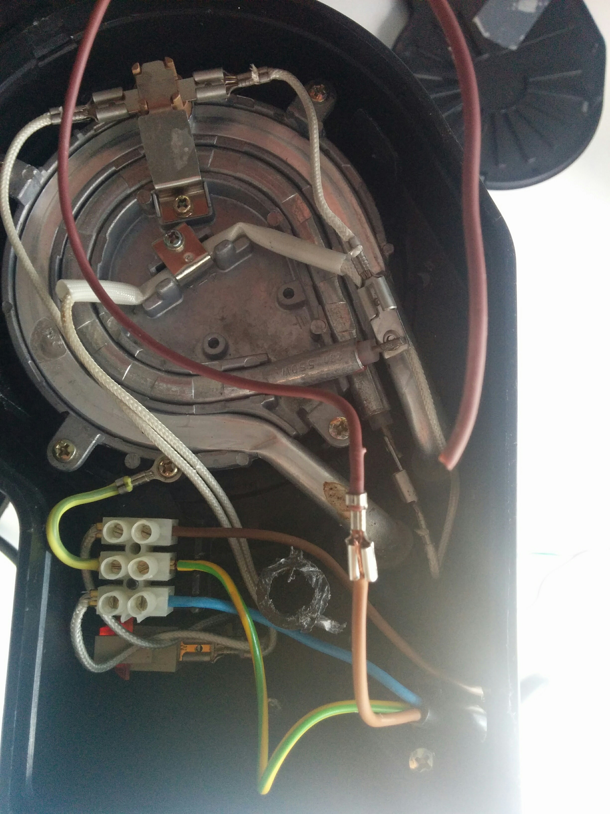
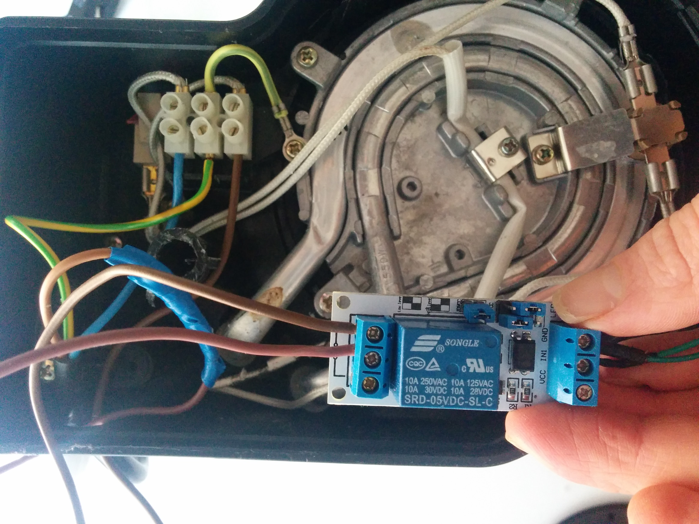
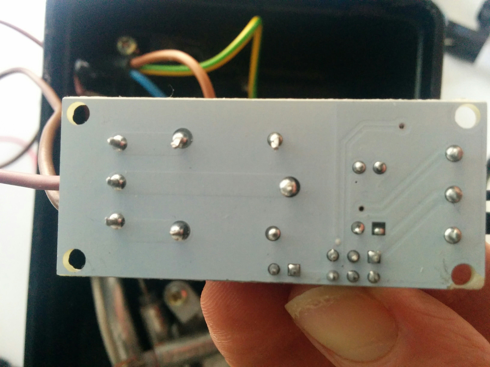
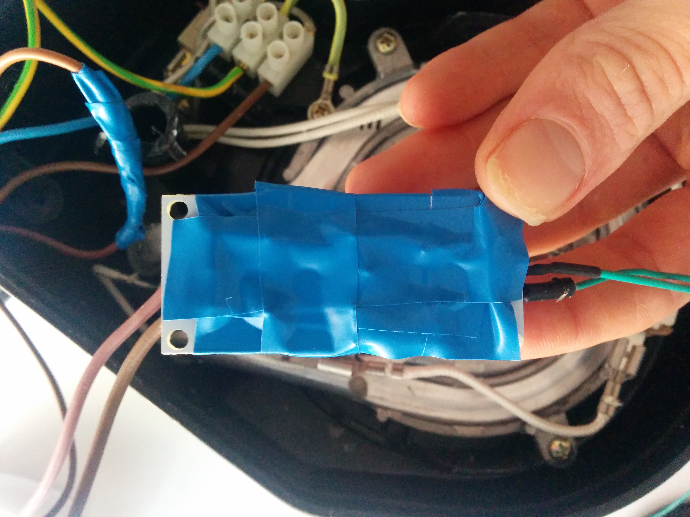
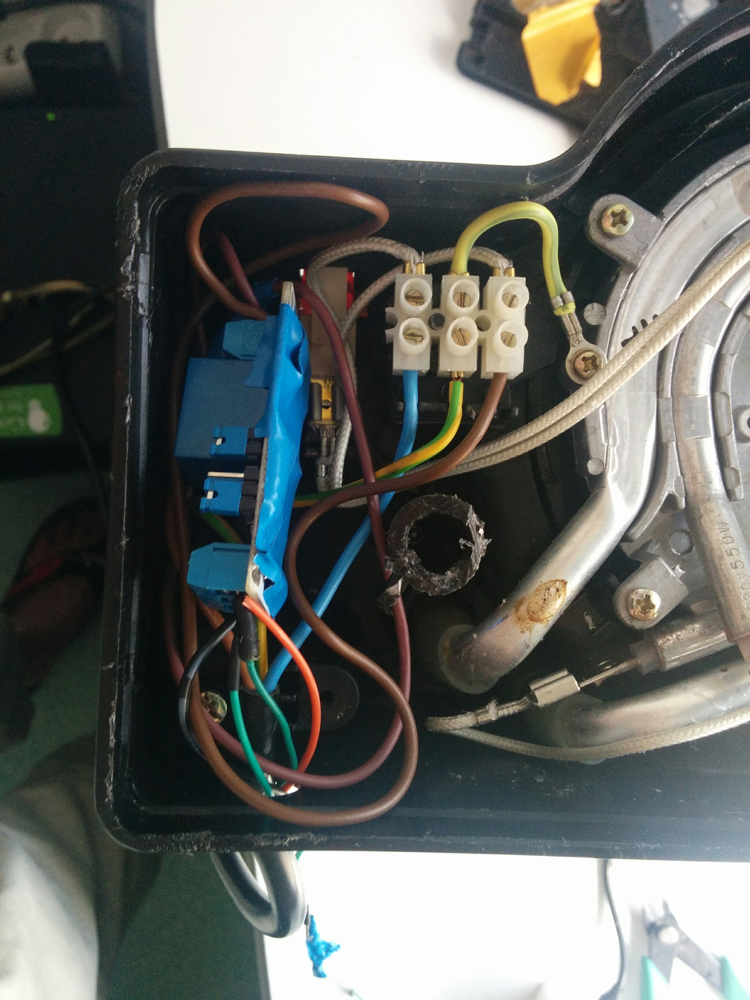
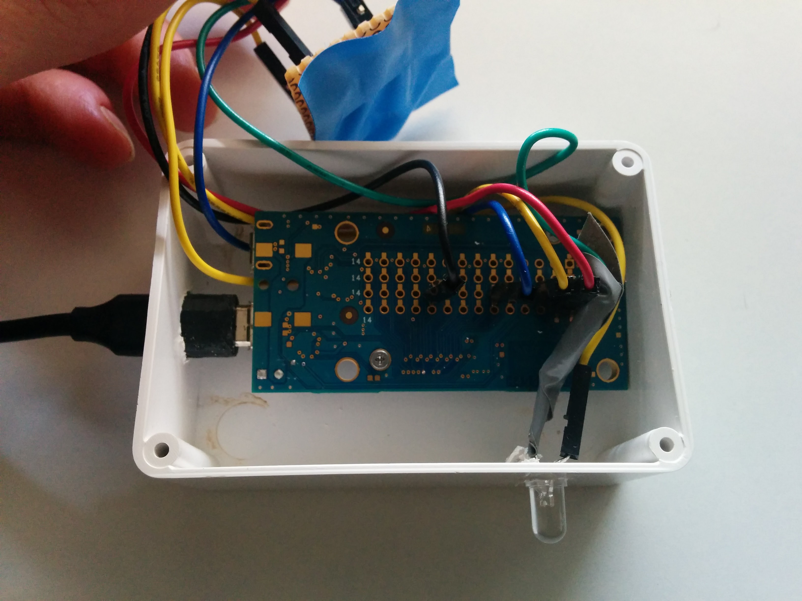
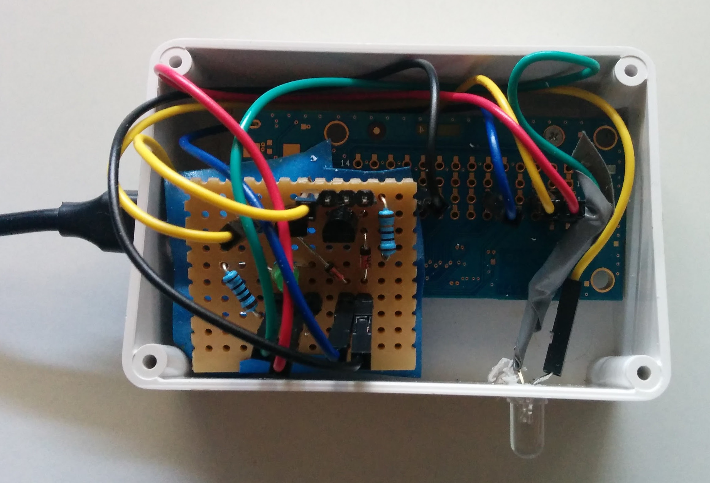

Build a tiny 'prod ready' case for the circuit and the Intel Edison
-----

This document explains how you can put the huge and unconvenient breaboard and wires into an handy case you just have to connect to your coffee maker.

## Material

The components are the same as ones described  [here](./hardware.md).

**In addition, you will need :**

* A plastic **enclosure** (at least 7x5x3 cm). [This one](http://uk.farnell.com/multicomp/g3107/enclosure-abs-grey-ip65-120x80x55mm/dp/1526653), for instance.
* A **drill** (to peforate the enclosure). If you haven't got a drill, it should work with a peaked screwdriver.
* A **stripboard**, on which we will solder the components. [This one one](http://uk.farnell.com/multicomp/n254-899/stripboard-sngl-sided-0-1inch/dp/9423230) will be perfect.
* A **soldering iron**.

## Step 1 : Build the PCB

This time we will use a stripboard instead of the breadboard to build a tinier circuit.
A stripboard is a circuit board with holes and printed strips of metal.

These boards are a good way of connecting simple to medium complicated circuits. They give you a lot of control of your connections and it’s relatively easy to fix errors.

On the back side of the stripboard you can see several strips of metal. These connect the holes either vertically or horizontally.

First, place all the components on the stripboard according to the [schematic](./images/trans-sch.png). Try to use the connections already on the stripboard as much as possible.

After placing a component, bend its leads to make it stay in place when you turn the stripboard around to solder.

Solder all the components to the stripboard and make sure you have good solder joints all over.

It’s very rare that you get all the connections you need just by using the strips on the board. So you will have to add some wires to create the remaining connections.

Create small wires by using a wire cutter. Cut a suitable length of wire and remove the isolation from both ends. This can be a bit hard with very short wires, so use longer ones if you have to.

## Step 2 : Prepare the Relay mdule and place it into the Coffee maker

Cut the phase wire, which is the brown one in the Step 2 picture.
Then, connect each end to the relay module, as in the next picture. The relay module will act as a switch, you can control with the Edison board.

### Use adhesive tape to isolate the relay module

### Finally, place the relay inside the Coffee Maker power block

## Step 3 : Perforate the enclosure

Using a drill or a very peaked screwdriver, perforate the enclosure three time:
- 1 for the indicator LED
- 1 for the Edison USB cable
- 1 for the 2 wires that connect the Edison to the Relay module inside the coffee machine

## Step 4 : Wire the LED, the PCB and the Edison

Using wires, as in next pictures, connect to the PCB:
- the LED
- the Edison GPIO that will controle the LED
- the Edison GPIO that will controle the coffee maker
- the Edison GND GPIO

## Step 4 : Finally, connect the case to the coffee maker
