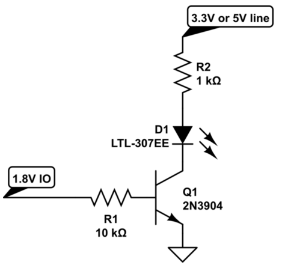

Coffee machine hardware modifications
-----

This document explains how you can easily modificate a cheap filter coffe maker and inteface it with the Intel Edison beakout board.

## Material
* Intel Edison Breakout board
* Breadboard
* 5V 10A Relay module (optocoupled)
* 2 Transistor BC547
* 2 Diodes 1N4148
* 2 LEDs (facultative)
* Wires, headeres, soldering iron

## Step 1 : Prepare the Edison board
The Intel Edison Breakout board exposes Edison GPIOs to the bottom of the board. Besides, it comes without headers pins and you need to add them by yourself.

We will use **J20-2** (3.3V) **J19-3** (GND) **J19-6** (GPIO 48 - LED) **J19-10** (GPIO 40 - Relay).

As next step, you'll see that the 1.8V logical levels from the Edison are too small to light an LED or to pilot the relay module. Without level shifting, the Edison has 1.8V voltage levels.

Oo solve this problem is by using a transistor. That what we will do in step 3. The schematic looks as below:

## Step 2 : Disasemble the machine power block

TODO

## Step 3 : Wire the machine to the Relay

TODO

## Step4 : Prepare the circuit

TODO
