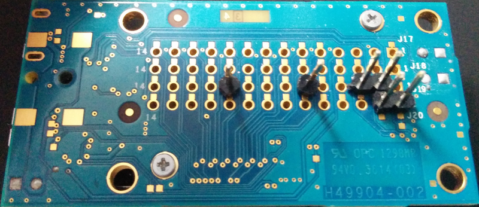
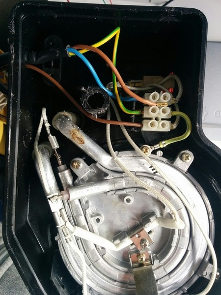
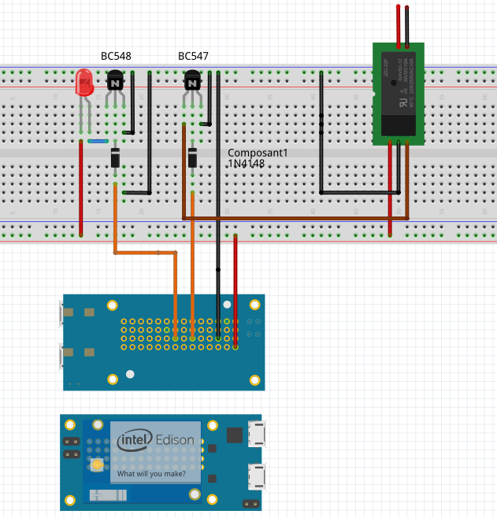

Coffee machine hardware modifications
-----

This document explains how you can easily modificate a cheap filter coffe maker and inteface it with the Intel Edison beakout board.

## Material
* Intel Edison Breakout board [(Here)](http://fr.farnell.com/intel/edi2bb-al-k/x86-edison-breakout-board-kit/dp/2499336)
* Breadboard [(Here)](http://fr.farnell.com/multicomp/mcbb400/carte-proto-sans-soudure-300v/dp/2395961?MER=BN-2395961)
* 5V 10A Relay module (optocoupled) [(Here)](http://fr.farnell.com/multicomp/bc547b/transistor-npn-to-92/dp/1574381?COM=main-search%20CMPNULL)
* 2 Transistor BC547 [(Here)](http://fr.farnell.com/multicomp/bc547b/transistor-npn-to-92/dp/1574381?COM=main-search%20CMPNULL)
* 2 Diodes 1N4148 [(Here)](http://fr.farnell.com/vishay/1n4148-tr/diode-de-redressement-standard/dp/1469384)
* 2 LEDs (facultative) [(Here)](http://fr.farnell.com/broadcom-limited/hlmp-3507/led-5mm-vert/dp/1003214?MER=BN-1003214)
* Wires, headers, soldering iron

## Step 1 : Prepare the Edison board
The Intel Edison Breakout board exposes Edison GPIOs to the bottom of the board. Besides, it comes without headers pins and you need to add them by yourself.

We will use **J20-2** (3.3V) **J19-3** (GND) **J19-6** (GPIO 48 - LED) **J19-10** (GPIO 40 - Relay).

As next step, you'll see that the 1.8V logical levels from the Edison are too small to light an LED or to pilot the relay module. Without level shifting, the Edison has 1.8V voltage levels.

To solve this problem you may use a transistor. That what we will do in step 3.
The schematic looks as below:

## Step 2 : Disasemble the machine power block

Unscrew the coffee make power block cover. Usually, it is at the bottom.

It should looks like the next picture :

## Step 3 : Wire the machine to the Relay

Cut the phase wire, which is the brown one in the Step 2 picture.
Then, connect each end to the relay module, as in the next picture. The relay module will act as a switch, you can control with the Edison board.

Note that you may need to extend the wire length to place the relay module with more convenience.

## Step4 : Wire the circuit

Finally, wire the control circuit, to interface the Intel Edison GPIO with the relay moule on the breadboard, like in the following image.

Your Intel Edison board can now controle the coffee maker

### Since you ensure everythings works, next step is building a tiny case for the Intel EDISON and the circuit following this [tutorial](./casing.md)
